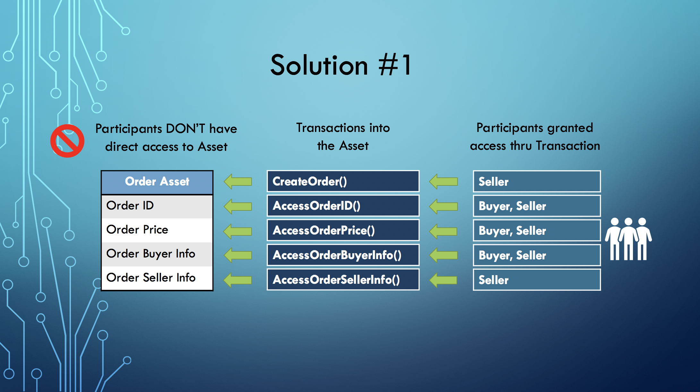
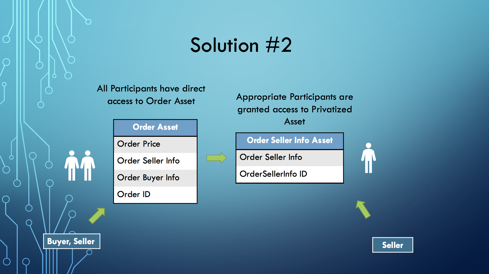

# Implementing Data Privatization Within Hyperledger Composer

While some of the most important features of a Hyperledger Blockchain network are transparency and trust, there are times in a business situation when different participants need access into partially privatized data being exchanged/managed within their business relationship. For example, in a supply chain management system let us assume a Buyer and a Seller are part of the same Organization and are represented as different Participants in a Business Network Definition within a Hyperledger Composer model. In this scenario, the Buyer places an Order for an item from a Seller. In the Order Asset, there might be information that only the Seller should update and see, like wholesale price, payment info, availability, inventory, etc. And there might be public data that both participants should have access to like retail sales price, order id, tracking number, customer address.

One of the benefits that Hyperledger Composer provides is simple modeling to define access control rules to govern defined Assets, Participants and Transactions. The Access Control syntax allows rules to be defined against an entire Asset and/or a Transaction Function. At this present time, rules cannot be defined against specific data fields within an Asset. So other than limiting access to an Asset’s data at the Application level how can we restrict access at the network level?

Basically, there are two different approaches:

**Approach #1:** Restrict full access to the Asset (in this case the Order) but provide explicit User Defined Transaction functions and Access Control Rules on those functions that allow limited access to the individual data fields within the Asset.



The code for this example is located in https://github.com/annumberhocker/hlc_confidentiality_ex/tree/master/private-data-example1

Note the rules in the permissions.acl file. The only access given to the Order Asset is the ability to create it within the CreateOrder Transaction function:

```
rule SellerReadandCreateOrder {
    description: "Allow Sellers to create order assets"
    participant(p): "org.privatedata.exampleone.Seller"
    operation:  CREATE
    resource(o): "org.privatedata.exampleone.Order"
    condition: (o.seller.getIdentifier() == p.getIdentifier())
    action: ALLOW
}
 
rule CREATE_tx_CreateOrder {
    description: "Allow Sellers to create the CreateOrder transaction"
    participant(p): "org.privatedata.exampleone.Seller"
    operation:  CREATE
    resource(tx): "org.privatedata.exampleone.CreateOrder"
    condition: (tx.seller.getIdentifier() == p.getIdentifier())
    action: ALLOW
}

rule Seller_AccessOrderinCreateOrder {
    description: "Seller can create an order asset thru this transaction"
    participant(p): "org.privatedata.exampleone.Seller"
    operation: CREATE
    resource(o): "org.privatedata.exampleone.Order"
    transaction(tx): "org.privatedata.exampleone.CreateOrder"
    condition: (o.seller.getIdentifier() === p.getIdentifier())
    action: ALLOW
}

```
Otherwise, only access is given through transactions such as:
```
rule UpdateOrderBuyerInfo {
    description: "Buyer and Seller can access order.BuyerInfo thru this transaction"
    participant(p): "org.privatedata.exampleone.*"
    operation: UPDATE, READ
    resource(o): "org.privatedata.exampleone.Order"
    transaction(tx): "org.privatedata.exampleone.UpdateOrderBuyerInfo"
    condition: (tx.order.getIdentifier() === o.getIdentifier() &&
               (o.seller.getIdentifier() === p.getIdentifier() ||
                o.buyer.getIdentifier() === p.getIdentifier()))
    action: ALLOW
}

rule CREATE_tx_UpdateOrderBuyerInfo {
    description: "Buyer and Seller can create the transaction"
    participant(p): "org.privatedata.exampleone.*"
    operation: CREATE
    resource(tx): "org.privatedata.exampleone.UpdateOrderBuyerInfo"
    condition: (tx.order.buyer.getIdentifier() === p.getIdentifier() ||
                tx.order.seller.getIdentifier() === p.getIdentifier())
    action: ALLOW
}
```

To see the data privatization in action, 
1)	Invoke the online [Bluemix Composer Playground](https://composer-playground.mybluemix.net/login).
2)  "Deploy a new business network"
3)  Select "Drop here to upload or browse" and select the [private-data-example1@0.0.1.bna](https://github.com/annumberhocker/hlc_confidentiality_ex/edit/master/private-data-example1/private-data-example1@0.0.1.bna)
4)	“Deploy changes”. 
5)	Select the “Test” tab.
6)	Create a Buyer and a Seller participant. 
7)	Create ids for the Buyer and Seller.  To do this see [Creating a Business Network Card].(https://hyperledger.github.io/composer/latest/playground/id-cards-playground) 
8)	Switch to Seller id.
9)	As the Seller, Submit a CreateOrder transaction function.  
Note: you will need to switch back to the Admin id to see the new Order asset since neither the Buyer nor the Seller have READ access to the actual Order Asset.
10)	The Seller can update the buyerInfo, the sellerInfo and the price on the Order Asset using the UpdateOrderPrice, UpdateOrderBuyerInfo, and the UpdateOrderSellerInfo transaction functions.
11)	Switch to Buyer id and try an UpdateOrderBuyerInfo transaction. The Buyer can only update the buyerInfo on the Order Asset.

One of the issues with this approach is that Queries will not work to get information from a privatized Asset. Queries are subject to Access Control Rules (see [Queries](https://hyperledger.github.io/composer/latest/business-network/query.html)) and in this case direct access is not granted to the private Asset. Events may be used to get the data as we have shown in our model. However once events are generated, and an application is set up to subscribe to them (see [Events](https://hyperledger.github.io/composer/latest/applications/subscribing-to-events.html)), the application can pick up any event it chooses (if it knows about it), gaining access to the payload. 

In this code, we demonstrate only emitting Events from within a Seller permissioned transaction function. We will say for the sake of this discussion that we only publish these Events for the purpose of a Seller enabled application function to receive and act on them.


**Approach #2:** Abstract out privatized data into its own Asset and control access to the Private Data Asset itself.



Here, we have separated out the private data into its own Asset in **org.privatedata.exampletwo.cto** file:
```
// Assets
asset OrderSellerInfo identified by infoId {
  o String infoId		       	          // same as Order it belongs to
  o String info      	                // private info only visible to Seller
  --> Order order		      	          // the Order that this is associated with
  --> Seller seller                   // the Seller that this is associated with
}

asset Order identified by orderId {
  o String orderId
  o Double price
  o String buyerInfo      		        // will be public info
  --> OrderSellerInfo sellerInfo    	// will be private only to Seller
  --> Seller seller
  --> Buyer buyer
}

transaction UpdateOrderSellerInfo {
  --> Order order			                // The order that this is associated with
  o String newInfo			              // The new information being added
}

```

To see the data privatization in action in this example:

1)	Invoke the online [Bluemix Composer Playground](https://composer-playground.mybluemix.net/login).
2)  "Deploy a new business network"
3)  Select "Drop here to upload or browse" and select the [private-data-example2@0.0.1.bna](https://github.com/annumberhocker/hlc_confidentiality_ex/edit/master/private-data-example1/private-data-example2@0.0.1.bna)
4)	“Deploy changes”. 
5)	Select the “Test” tab.
6)	Create a Buyer and a Seller participant. 
7)	Create ids for the Buyer and Seller.  To do this see [Creating a Business Network Card].(https://hyperledger.github.io/composer/latest/playground/id-cards-playground)
8)	Switch to Seller id.
9)	As the Seller, Submit a CreateOrder transaction function.  Note: an Order Asset and an OrderSellerInfo Asset will be created.  The Seller can see both.
10)	As the seller, invoke a CreateOrder transaction function.  
11)	Change to the Buyer identity and you will only be able to see the Order Asset.
12)	The Seller can update the buyerInfo and the sellerInfo on the Order Asset either using the UpdateOrderBuyerInfo and the UpdateOrderSellerInfo transaction functions.
13)	The Buyer can only update the buyerInfo on the Order Asset.

To finish out this example a .qry file can added to the model to define queries against the privatized asset and a transaction function can be added to include the code to call on the queries that have been defined to get access to the privatized Asset data. Or the query can be invoked directly from the client application. See the [Queries Tutorial](https://hyperledger.github.io/composer/latest/tutorials/queries) and [Query Language Reference Documentation](https://hyperledger.github.io/composer/latest/api/client-businessnetworkconnection#buildquery) for more information.

In summary, there are several ways think about data privacy.  Depending on how your network is architected, you might want to address this at the Fabric level using [Channels](https://hyperledger-fabric.readthedocs.io/en/release-1.1/channels.html) and eventually [Collections](https://hyperledger-fabric.readthedocs.io/en/release-1.2/private-data/private-data.html).  In this article we addressed it at the higher level in the Business Network design using Hyperledger Composer.

